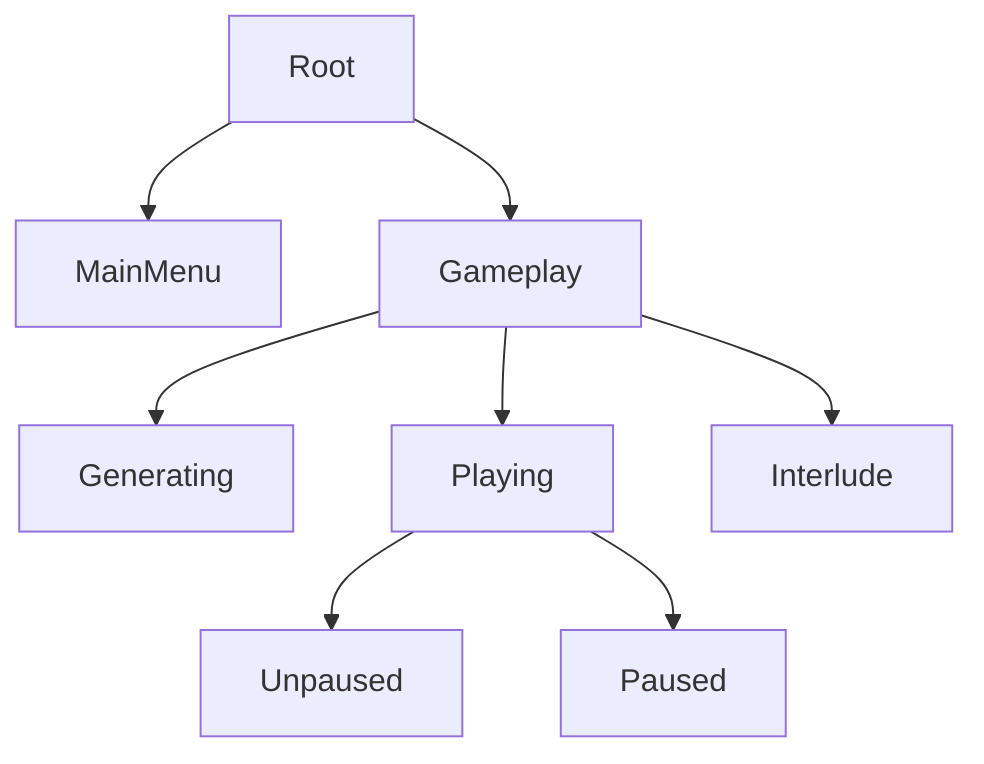

# Pattern Name: Lazy States Hierarchy

## Summary

This pattern allows for simple implementation of hierarchical states.
It uses relatively little boilerplate at the expense of propagation delay.

## Problem

Most applications require some sort state tree-like structure.
For example:

While Bevy's API supports flat states structures very well,
ensuring all states in a hierarchy are correctly updates can be difficult.

## Solution

Multiple enums can be used to represent each layer of the hierarchy.

All non-root states require an additional "disabled" state, which signifies their parent state is not enabled.

The updates are done on parent-child basis, for each layer of propagation you need to add 2 systems.
One for setting the default enabled child state, second for disabling the child state.

[Example](./src/lib.rs)

## Cons

Requires an additional "disabled" state in all but root states.

Propagation time is proportional to the amount of states that need to be updated, this can lead to race condition between logic of different states.
For example, if the existence of camera is controlled in 2 separate state enums (somehow related to eachother in the hierarchy), there can be 2 cameras existing or no cameras existing for 1+ frames.

## Alternatives

Store child states inside of parent states directly.
This adds problems to `OnEnter`-like schedules, where a change in substate will trigger a false change in parent state.

Add an alternative states plugin which uses enum discriminants instead of raw values.
This would fix the `OnEnter`-like schedule problems from previous alternative.

Add a state manager object, that updates all states within a frame.
This would require some thinking to make it less boiler-platey.

## Related patterns

None

## Tags

states hierarchy, lazy propagation
